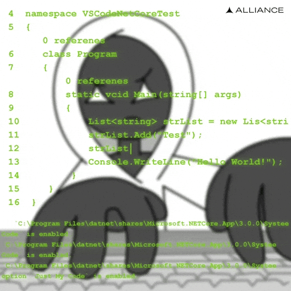

<h1 align="center">👨‍💻 Luiz Felipe</h1>

  Desenvolvedor apaixonado por tecnologia, aprendizado contínuo e novos desafios.

  💻 Código • 🎵 Música • 🛹 Skate • 🎮 Games

---

### 🚀 Sobre mim

- 🔥 Sempre buscando aprender algo novo
- 💡 Apaixonado por transformar ideias em soluções
- 📚 Evolução constante acima da zona de conforto
- ⚡ Meu maior bug? Sentir que estou estagnado

### 🛠 Tech Stack

`JavaScript` `Node.js` `Python` `Power Apps` `Power Automate` `SharePoint` `Git`

### 📊 Estatísticas

![GitHub Stats](https://github-readme-stats.vercel.app/api?ARIO&show_icons=true&theme=radical

### 🎯 Filosofia

> "Aprender, construir e evoluir. Repetir."

---
⭐ Bem-vindo ao meu perfil!